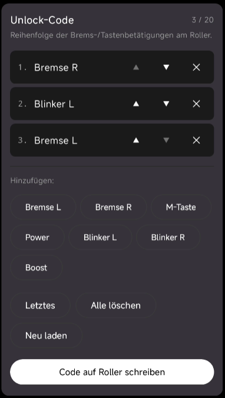

# G3 Max Panickey Patched Firmware + QuickConfig-App

Gepatchte VCU-Firmware („PFW") für den **Ninebot G3 Max**, als SHU-Paket zum Flashen über die
**ScooterHacking Utility**, plus eine Android-App zum Konfigurieren per Bluetooth.

- **Panic-Taste** — Switch ohne ausschalten des rolers in Originales Speed Limit.
- **Custom Unlock Code** — frei belegbare Brems-/Tasten-Sequenz („Unlock-Code") am Roller.

## Flashen

1. **Einmalig:** [`ztakis/x3utils`](https://github.com/ztakis/x3utils) → *„Flash SHU compatible"*
   per ST-Link/SWD. Setzt den Distributions-Key, damit die VCU SHU-Pakete annimmt.
2. Gewünschtes `.zip` über die **ScooterHacking Utility** flashen (Typ VCU).
3. Roller neu starten, in der App die Version prüfen (V9.9.9 bzw. V9.9.8).

Ein Wechsel zwischen den beiden Builds ist jederzeit in beide Richtungen möglich.

**Vorher ein SWD-Backup der VCU ziehen.** Das ist der Fallback, falls ein Flash schiefgeht — die
VCU ist per ST-Link immer wiederherstellbar, solange man ein Image hat.

  

Other useful links
https://github.com/Sharkboy-j/ninebot-g3-max-vcu-speed-hack
